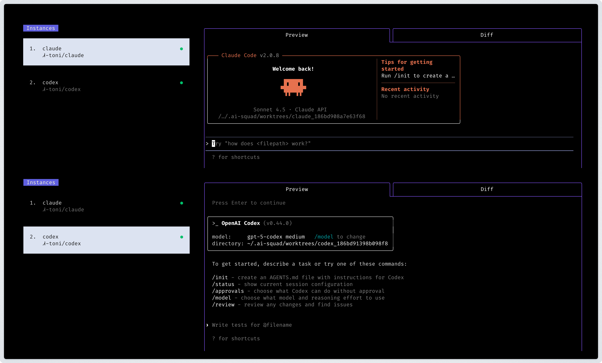

# AI Squad [](https://github.com/portofolio-mager/ai-squad/actions/workflows/build.yml) [](https://github.com/portofolio-mager/ai-squad/releases/latest)
 
> Note: This project is a fork of https://github.com/smtg-ai/claude-squad.
 
[AI Squad](https://portofolio-mager.github.io/ai-squad/) is a terminal app that manages multiple [Claude Code](https://github.com/anthropics/claude-code), [Codex](https://github.com/openai/codex), [Gemini](https://github.com/google-gemini/gemini-cli) (and other local agents including [Aider](https://github.com/Aider-AI/aider)) in separate workspaces, allowing you to work on multiple tasks simultaneously.




### Highlights
- Complete tasks in the background (including yolo / auto-accept mode!)
- Manage instances and tasks in one terminal window
- Review changes before applying them, checkout changes before pushing them
- Each task gets its own isolated git workspace, so no conflicts
- Dynamic project switching
- Add Qwen and Crush (AI assistants, similar to Claude Code, Codex, Gemini, Aider)

<br />

<!-- https://github.com/user-attachments/assets/aef18253-e58f-4525-9032-f5a3d66c975a -->

<br />

### Installation

Both Homebrew and manual installation will install AI Squad as `ais` on your system.

#### Manual

AI Squad can also be installed by running the following command:

```bash
curl -fsSL https://raw.githubusercontent.com/portofolio-mager/ai-squad/dev/install.sh | bash
```

This puts the `ais` binary in `~/.local/bin`.

To use a custom name for the binary:

```bash
curl -fsSL https://raw.githubusercontent.com/portofolio-mager/ai-squad/dev/install.sh | bash -s -- --name <your-binary-name>
```

#### Homebrew (not published yet)

```bash
brew install ai-squad
ln -s "$(brew --prefix)/bin/ai-squad" "$(brew --prefix)/bin/ais"
```

### Prerequisites

- [tmux](https://github.com/tmux/tmux/wiki/Installing)
- [gh](https://cli.github.com/)

### Usage

```
Usage:
  ais [flags]
  ais [command]

Available Commands:
  completion  Generate the autocompletion script for the specified shell
  debug       Print debug information like config paths
  help        Help about any command
  reset       Reset all stored instances
  version     Print the version number of ai-squad

Flags:
  -y, --autoyes          [experimental] If enabled, all instances will automatically accept prompts for claude code & aider
  -h, --help             help for ai-squad
  -p, --program string   Program to run in new instances (e.g. 'aider --model ollama_chat/gemma3:1b')
```

Run the application with:

```bash
ais
```
NOTE: The default program is `claude` and we recommend using the latest version.

<br />

<b>Using AI Squad with other AI assistants:</b>
- For [Codex](https://github.com/openai/codex): Set your API key with `export OPENAI_API_KEY=<your_key>`
- Launch with specific assistants:
   - Codex: `ais -p "codex"`
   - Aider: `ais -p "aider ..."`
   - Gemini: `ais -p "gemini"`
   - Qwen: `ais -p "qwen"`
   - Crush: `ais -p "crush"`
- Make this the default, by modifying the config file (locate with `ais debug`)

<br />

#### Menu
The menu at the bottom of the screen shows available commands: 

##### Instance/Session Management
- `n` - Create a new session
- `N` - Create a new session with a prompt
- `D` - Kill (delete) the selected session
- `↑/j`, `↓/k` - Navigate between sessions

##### Actions
- `↵/o` - Attach to the selected session to reprompt
- `ctrl-q` - Detach from session
- `s` - Commit and push branch to github
- `c` - Checkout. Commits changes and pauses the session
- `r` - Resume a paused session
- `?` - Show help menu

##### Navigation
- `tab` - Switch between preview tab and diff tab
- `q` - Quit the application
- `shift-↓/↑` - scroll in diff view

### FAQs

#### Failed to start new session

If you get an error like `failed to start new session: timed out waiting for tmux session`, update the
underlying program (ex. `claude`) to the latest version.

### How It Works

1. **tmux** to create isolated terminal sessions for each agent
2. **git worktrees** to isolate codebases so each session works on its own branch
3. A simple TUI interface for easy navigation and management

### License

[AGPL-3.0](LICENSE.md)

### Star History

[](https://www.star-history.com/#portofolio-mager/ai-squad&Date)

<!-- triggers -->